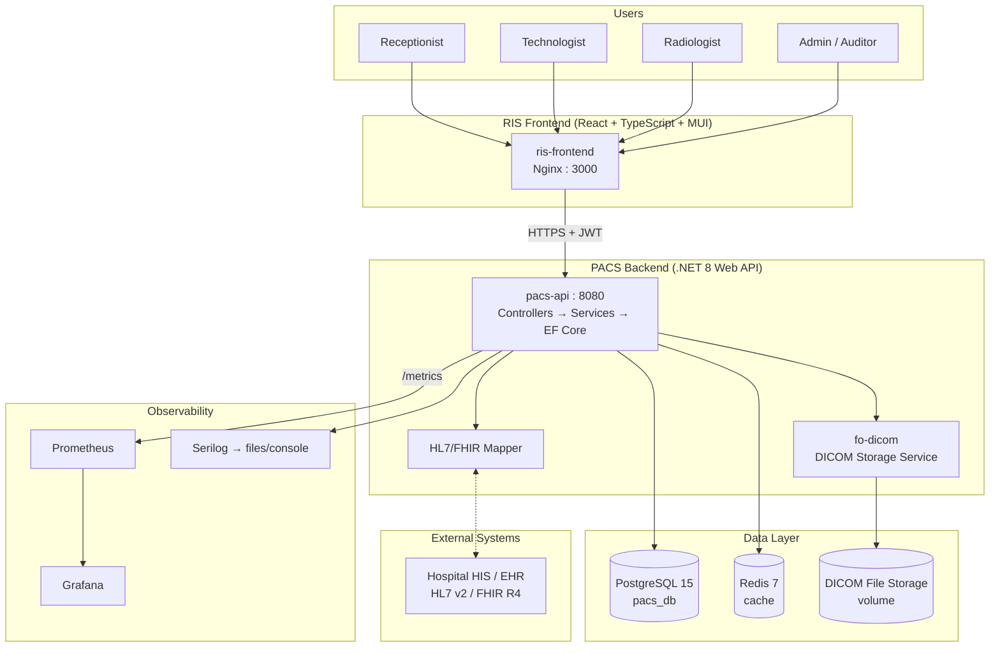
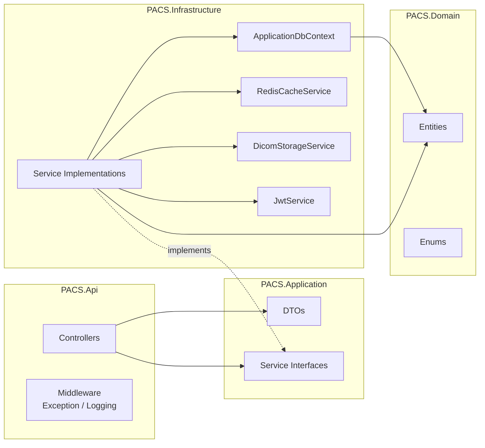
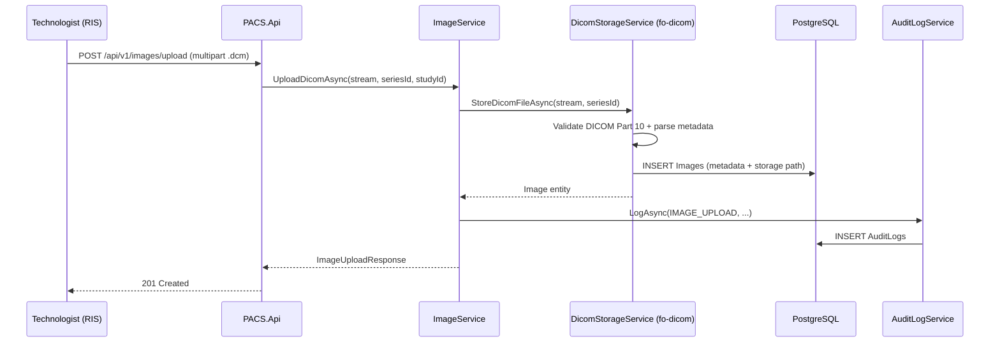

# Architecture Diagram

## System Context

```mermaid
flowchart TB
    subgraph Users
        RECEP[Receptionist]
        TECH[Technologist]
        RAD[Radiologist]
        ADMIN[Admin / Auditor]
    end

    subgraph "RIS Frontend (React + TypeScript + MUI)"
        RIS[ris-frontend<br/>Nginx : 3000]
    end

    subgraph "PACS Backend (.NET 8 Web API)"
        API[pacs-api : 8080<br/>Controllers → Services → EF Core]
        DICOM[fo-dicom<br/>DICOM Storage Service]
        FHIR[HL7/FHIR Mapper]
    end

    subgraph Data Layer
        PG[(PostgreSQL 15<br/>pacs_db)]
        REDIS[(Redis 7<br/>cache)]
        DISK[(DICOM File Storage<br/>volume)]
    end

    subgraph Observability
        PROM[Prometheus]
        GRAF[Grafana]
        LOGS[Serilog → files/console]
    end

    subgraph External Systems
        HIS[Hospital HIS / EHR<br/>HL7 v2 / FHIR R4]
    end

    RECEP --> RIS
    TECH --> RIS
    RAD --> RIS
    ADMIN --> RIS

    RIS -->|HTTPS + JWT| API
    API --> DICOM
    API --> FHIR
    DICOM --> DISK
    API --> PG
    API --> REDIS
    FHIR <-.-> HIS

    API -->|/metrics| PROM
    PROM --> GRAF
    API --> LOGS
```

## Layered Backend Architecture (Clean Architecture)

```mermaid
flowchart LR
    subgraph "PACS.Api"
        CTRL[Controllers]
        MW[Middleware<br/>Exception / Logging]
    end

    subgraph "PACS.Application"
        DTO[DTOs]
        IFACE[Service Interfaces]
    end

    subgraph "PACS.Infrastructure"
        SVC[Service Implementations]
        DB[ApplicationDbContext]
        CACHE[RedisCacheService]
        DICOMSVC[DicomStorageService]
        JWTSVC[JwtService]
    end

    subgraph "PACS.Domain"
        ENT[Entities]
        ENUM[Enums]
    end

    CTRL --> IFACE
    CTRL --> DTO
    SVC -.implements.-> IFACE
    SVC --> DB
    SVC --> CACHE
    SVC --> DICOMSVC
    SVC --> JWTSVC
    DB --> ENT
    SVC --> ENT
```

## Request Flow: DICOM Upload

```mermaid
sequenceDiagram
    participant T as Technologist (RIS)
    participant API as PACS.Api
    participant IMG as ImageService
    participant DCM as DicomStorageService (fo-dicom)
    participant DB as PostgreSQL
    participant AUD as AuditLogService

    T->>API: POST /api/v1/images/upload (multipart .dcm)
    API->>IMG: UploadDicomAsync(stream, seriesId, studyId)
    IMG->>DCM: StoreDicomFileAsync(stream, seriesId)
    DCM->>DCM: Validate DICOM Part 10 + parse metadata
    DCM->>DB: INSERT Images (metadata + storage path)
    DCM-->>IMG: Image entity
    IMG->>AUD: LogAsync(IMAGE_UPLOAD, ...)
    AUD->>DB: INSERT AuditLogs
    IMG-->>API: ImageUploadResponse
    API-->>T: 201 Created
```

## CI/CD Pipeline Flow

```mermaid
flowchart LR
    A[Push / PR] --> B[Build Dependencies<br/>npm install · dotnet restore]
    B --> C[Code Quality<br/>ESLint · tsc · dotnet format]
    C --> D[Unit Tests + Coverage<br/>Jest · xUnit]
    D --> E[Security Scanning<br/>CodeQL · Gitleaks · npm audit · NuGet scan]
    E --> F[Build<br/>npm run build · dotnet publish]
    F --> G[Docker Build + Trivy Scan]
    G -->|scan pass| H[Push to GHCR]
    H --> I[Deploy via Docker Compose<br/>SSH to host]
```
